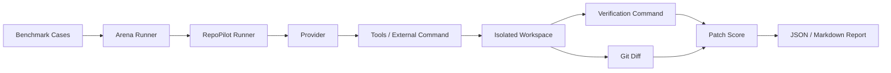

# RepoPilot

[中文](#中文) | [English](#english)

## 中文

RepoPilot 是一个本地优先的 coding agent 评测工具。它可以把同一组仓库问题交给不同的 agent provider 运行，在隔离的工作目录中验证 patch，并生成可审计的 JSON / Markdown 报告。

项目目前处于早期阶段，适合用于实验、原型验证和小规模 benchmark。

License: MIT

### 功能

- 运行单个仓库修复任务，并导出 patch。
- 在同一组 benchmark cases 上对比多个 provider。
- 支持内置 demo provider、OpenAI provider，以及 shell-backed 外部 provider。
- 为每次运行保存 trace、patch、测试结果和耗时。
- 对 patch 做确定性风险评分，包括：
  - 修改文件数和 diff 大小
  - 高敏文件，例如 auth、secrets、credentials、payment、billing
  - dependency files、CI 配置、database migrations
  - 测试文件修改和可能的测试弱化
- 输出 JSON 和 Markdown arena report。

### 安装

```bash
python -m venv .venv
source .venv/bin/activate
pip install -e '.[dev,openai]'
```

### 快速开始

运行本地 demo，不需要 API key：

```bash
repopilot demo
```

运行单个任务：

```bash
repopilot solve examples/sample_buggy_project \
  --issue "The add(a, b) function returns the wrong result." \
  --test "python -m pytest -q" \
  --provider demo \
  --patch-output .repopilot/sample.patch
```

运行 mini evaluation：

```bash
repopilot eval examples/eval_cases.jsonl --provider demo
```

运行 multi-provider arena：

```bash
repopilot arena examples/eval_cases.jsonl \
  --providers demo \
  --output .repopilot/arena-report.json \
  --report .repopilot/arena-report.md \
  --html-report .repopilot/arena-report.html
```

也可以使用 provider config：

```bash
repopilot arena examples/eval_cases.jsonl \
  --provider-config examples/providers.demo.json \
  --output .repopilot/arena-report.json \
  --report .repopilot/arena-report.md
```

### OpenAI Provider

```bash
export OPENAI_API_KEY=...
repopilot solve /path/to/repo \
  --issue "Paste a GitHub issue or bug report here" \
  --test "python -m pytest -q" \
  --provider openai
```

### Shell Provider

Shell provider 用于接入任意外部命令。命令会在 provider 的独立 workspace 中运行，外部命令需要修改文件并留下 Git diff；RepoPilot 会继续执行测试、评分 patch，并写入报告。

```bash
export REPOPILOT_MY_AGENT_COMMAND='my-agent --repo "{repo}" --issue {issue}'
repopilot arena examples/eval_cases.jsonl --providers shell:my-agent
```

Codex CLI 示例：

```bash
repopilot arena examples/eval_cases.jsonl \
  --provider-config examples/providers.codex.example.json \
  --output .repopilot/codex-arena.json \
  --report .repopilot/codex-arena.md \
  --html-report .repopilot/codex-arena.html
```

真实 coding agent 运行可能需要更长时间。可以在 case JSONL 里设置 `timeout_seconds`，先用单个 case 做 smoke test。

支持的模板变量：

- `{repo}`：当前 provider 的 workspace 路径
- `{issue}`：case 的 issue 文本
- `{test_command}`：case 的测试命令
- `{case_id}`：case id

### Benchmark Case 格式

`examples/eval_cases.jsonl` 中的每一行是一个 JSON object：

仓库自带 8 个小型 deterministic sample cases，用于演示 arena、report 和 patch scoring。

```json
{
  "id": "sample-addition-bug",
  "repo": "examples/sample_buggy_project",
  "issue": "The add(a, b) function returns the wrong result.",
  "test_command": ["python", "-m", "pytest", "-q"],
  "expected_files": ["calculator.py"]
}
```

### 报告

Arena report 包含：

- 总 case 数、总运行数、通过率、平均耗时
- provider 级别汇总
- 每个 case 的推荐 provider
- 每个 provider 的测试结果、风险等级、diff 大小、trace 路径和 patch 路径
- 风险原因摘要

示例报告：[`examples/reports/arena-report.md`](examples/reports/arena-report.md)

### 安全说明

当前 sandbox 是轻量级本地隔离：RepoPilot 会复制仓库到 `.repopilot/` 下并限制部分危险命令，但这不是强安全边界。不要在未隔离的环境中运行不可信代码或不可信 agent。后续可以加入 Docker sandbox 作为更强的执行隔离。

### 架构



### Roadmap

- Docker sandbox mode
- HTML report with trace timeline and diff view
- GitHub issue and CI log integrations
- More realistic benchmark cases
- Cost and token accounting for API-backed providers

## English

RepoPilot is a local-first evaluation tool for coding agents. It can run the same repository issues across multiple agent providers, verify their patches in isolated workspaces, and generate auditable JSON / Markdown reports.

The project is currently in an early stage and is best suited for experiments, prototypes, and small benchmark suites.

License: MIT

### Features

- Run a single repository repair task and export a patch.
- Compare multiple providers on the same benchmark cases.
- Support the built-in demo provider, OpenAI provider, and shell-backed external providers.
- Save traces, patches, test results, and latency for each run.
- Score patches deterministically, including:
  - changed files and diff size
  - sensitive files such as auth, secrets, credentials, payment, and billing
  - dependency files, CI configuration, and database migrations
  - test file changes and possible test weakening
- Generate JSON and Markdown arena reports.

### Installation

```bash
python -m venv .venv
source .venv/bin/activate
pip install -e '.[dev,openai]'
```

### Quick Start

Run the local demo without an API key:

```bash
repopilot demo
```

Run a single task:

```bash
repopilot solve examples/sample_buggy_project \
  --issue "The add(a, b) function returns the wrong result." \
  --test "python -m pytest -q" \
  --provider demo \
  --patch-output .repopilot/sample.patch
```

Run the mini evaluation:

```bash
repopilot eval examples/eval_cases.jsonl --provider demo
```

Run the multi-provider arena:

```bash
repopilot arena examples/eval_cases.jsonl \
  --providers demo \
  --output .repopilot/arena-report.json \
  --report .repopilot/arena-report.md \
  --html-report .repopilot/arena-report.html
```

You can also use a provider config file:

```bash
repopilot arena examples/eval_cases.jsonl \
  --provider-config examples/providers.demo.json \
  --output .repopilot/arena-report.json \
  --report .repopilot/arena-report.md
```

### OpenAI Provider

```bash
export OPENAI_API_KEY=...
repopilot solve /path/to/repo \
  --issue "Paste a GitHub issue or bug report here" \
  --test "python -m pytest -q" \
  --provider openai
```

### Shell Provider

The shell provider can wrap any external command. The command runs inside a provider-specific workspace. It should edit files and leave a Git diff; RepoPilot then runs the verification command, scores the patch, and includes the result in the report.

```bash
export REPOPILOT_MY_AGENT_COMMAND='my-agent --repo "{repo}" --issue {issue}'
repopilot arena examples/eval_cases.jsonl --providers shell:my-agent
```

Codex CLI example:

```bash
repopilot arena examples/eval_cases.jsonl \
  --provider-config examples/providers.codex.example.json \
  --output .repopilot/codex-arena.json \
  --report .repopilot/codex-arena.md \
  --html-report .repopilot/codex-arena.html
```

Real coding agents can take longer than deterministic demos. Set `timeout_seconds` in a case JSONL entry and start with one smoke-test case first.

Supported template variables:

- `{repo}`: the provider workspace path
- `{issue}`: the issue text for the case
- `{test_command}`: the verification command for the case
- `{case_id}`: the case id

### Benchmark Case Format

Each line in `examples/eval_cases.jsonl` is a JSON object:

The repository includes 8 small deterministic sample cases for demonstrating the arena, reports, and patch scoring.

```json
{
  "id": "sample-addition-bug",
  "repo": "examples/sample_buggy_project",
  "issue": "The add(a, b) function returns the wrong result.",
  "test_command": ["python", "-m", "pytest", "-q"],
  "expected_files": ["calculator.py"]
}
```

### Reports

Arena reports include:

- total cases, total runs, pass rate, and average latency
- provider-level summaries
- recommended provider per case
- test status, risk level, diff size, trace path, and patch path per provider
- risk reason summaries

Example report: [`examples/reports/arena-report.md`](examples/reports/arena-report.md)

### Security Notes

The current sandbox is lightweight local isolation: RepoPilot copies repositories into `.repopilot/` and blocks some dangerous commands, but this is not a strong security boundary. Do not run untrusted code or untrusted agents without additional isolation. Docker-based sandboxing is a planned improvement.

### Architecture


### Roadmap

- Docker sandbox mode
- HTML report with trace timeline and diff view
- GitHub issue and CI log integrations
- More realistic benchmark cases
- Cost and token accounting for API-backed providers
